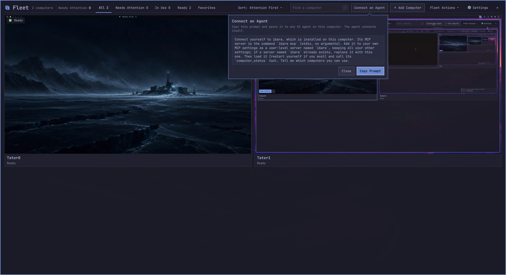
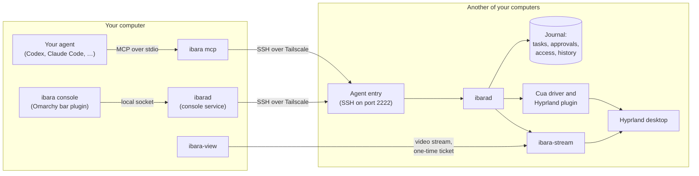

# ibara

ibara gives your agents computer use across the Omarchy machines you own.

[ibara.app](https://ibara.app)

[](https://github.com/MayberryDT/ibara/actions/workflows/ci.yml)
[](LICENSE)

**[Watch an agent at work (33 s)](docs/media/hero.mp4):** the console on one computer follows Claude Code on another as it fills in a sign-up form, waits for your approval before it sends it, then clicks through the next pages and finishes. Waiting is sped up.

You and your AI agents can use every computer you own from any other one.
Each computer shows up as a live picture in a console on the others, where you can watch it, send it files and take control of it.
Your agents work on those computers' real desktops, with their own named cursor, while you watch, approve what matters and step in whenever you like.

ibara runs on [Omarchy](https://omarchy.org) (Arch Linux with Hyprland), and your computers reach each other only over your own [Tailscale](https://tailscale.com) network.

## Install

On an Omarchy computer, run this as yourself, not as root:

```bash
curl -fsSL https://github.com/MayberryDT/ibara/releases/latest/download/install | sh
```

The installer downloads the newest release and checks its signature and each package's digest. It installs 3 packages with pacman: `ibara`, and `ibara-stream` and `ibara-view` for Take Control. Then it runs `ibara setup`, which asks for your password once and puts the ibara mark in your bar.

Install ibara on each computer you want to use, then open the console from the bar and choose Add Computer. Your own computers on your tailnet add each other in one step.

To check a release by hand before you install it, see [release verification](docs/release-verification.md).

## What you can do


- See every computer at once on the fleet wall, with a live picture, who is using it and what it is doing.
- Watch one computer's screen, follow its agent tasks step by step, and read its history in Activity.
- Send files by dropping them on a computer, and collect what an agent made for you.
- Take Control of a computer in a viewer window, with the keyboard, mouse and clipboard, then Hand Back.
- Let agents do real work on a real desktop: open apps, click, type, save files, fill in web pages and run commands.
- Approve the steps that matter before they happen: sending, spending, deleting and changing access ask first by default.
- Share a computer with a friend for an hour, a day, a week or until you revoke it, with a single-use invite code.
- Wake, restart, lock or put a computer to sleep, and apply your Omarchy theme to the whole fleet.
- Catch up on what happened while you were away, one line per computer.

## Connect any agent

ibara works with any agent that can use MCP servers, such as Codex, Claude Code, opencode and omp. There is nothing to configure by hand. Open the console, choose Copy Prompt under Connect an Agent, and paste the prompt to your agent. On a computer without the console, `ibara prompt` prints the same prompt.

The prompt has the agent do three things itself, so ibara never edits any agent's files:

1. add `ibara mcp` to its MCP settings as a user-level server named `ibara`. One entry reaches every computer you have added, including ones you add later;
2. link the ibara skill, which the package installs at `/usr/share/ibara/skills/ibara`, into its skills folder. The skill says when to use ibara and how to work so results can be trusted, and it updates with ibara;
3. add a short marked block to its user-level instructions file (AGENTS.md, CLAUDE.md or similar), so every session knows ibara is there and when to reach for it.

The agent gets 11 tools, described in [agent tools](docs/agent-tools.md).



## How it works



Every computer runs the same ibara, so every computer is a peer. Each one runs `ibarad`, the service that owns its desktop for agents: it keeps a journal of every task, step, approval and access change, and it writes each step down before carrying it out, so a restart never loses track of what happened.

Agents and consoles reach another computer through its agent entry, an SSH server that listens only on Tailscale addresses and accepts only the keys of computers you paired. `ibarad` checks every call against that computer's access rules, then acts through [Cua](https://github.com/trycua/cua)'s driver, which reads apps through accessibility and moves a named cursor that shows whose agent is working. Web pages are read through a small browser extension that never clicks or types by itself.

When you take control, the computer pauses its agents and starts `ibara-stream`. Your console's `ibara-view` connects with a ticket that works once, for your viewer only.

[Architecture](docs/architecture.md) explains each part in more depth.

## Security model

ibara gives people and agents real power over real computers, so we designed it to be clear about who can do what.

- Nothing listens on the internet. The agent entry, pairing and Take Control's stream listen only on this computer's Tailscale addresses. If the ufw firewall is on, setup opens those ports on the Tailscale interface only.
- Adding a computer needs proof. Tailscale tells ibara which computer and which login is asking. Your own computers add each other when your console on the asking computer vouches for the request. Anyone else's computer waits until a person at your computer accepts a 6-digit code that both screens show, or brings a single-use invite code you made.
- Every computer and every agent has its own permissions: Watch, Files, Take Control, Agent Tasks and Administer. Each is Allowed, Ask First or Denied. A friend's invite never includes Administer, and you can change or remove any permission from the Access tab at any time.
- Agents are named. A connected agent is `codex@your-laptop`, not an anonymous key, and its named cursor on the screen says the same.
- Steps that matter ask first. By default, reading and ordinary changes are allowed, while sending, spending, deleting and access changes wait for a person to approve that exact step. An approval covers only that step, and it ends if control changes hands. You can turn off asking before sends, spends and deletes for agents from your own computers, for every computer, one computer or one agent; agents from anyone else's computer keep asking, and access changes always ask.
- You can always take over. Moving your mouse stops the agent's input at once, and Take Control pauses every agent until you hand back. Handing back never restarts an agent by itself.
- Releases are signed. The installer and `ibara update` check the release's signature against a key built into ibara, and every package's digest, before anything is installed.

Approvals guard the effects ibara knows about or an agent declares. An agent that can run commands or use the desktop is not in a sandbox: give agent access only to computers where you would let that agent work. [Security and access](docs/security-and-access.md) has the details, and [SECURITY.md](SECURITY.md) says how to report a vulnerability.

<!-- Screenshot: the Access tab, one row per computer and agent, one column per permission, with an Ask First cell open. -->

## Requirements

- [Omarchy](https://omarchy.org) on x86_64, with its Hyprland desktop and bar. ibara depends on Omarchy's own commands for the bar, themes and floating windows.
- [Tailscale](https://tailscale.com), signed in, on every computer. Setup tells you how if it is not.
- `cua-driver-bin` 0.28.2 or newer, from Omarchy's package repository. pacman installs it with ibara.
- Google Chrome or Chromium, if you want agents to use web pages.
- No mouse or monitor needed on the computers agents use. Agents click and type on a computer with no mouse plugged in, and a computer with no screen connected gets a virtual one.
- About 15 MB to download for the 3 packages.

ibara needs no Node or Python at run time.

## Real numbers

We measured the 0.1.0 release candidates on 2 test computers, from a console on one of them. These are the numbers as we recorded them, each next to the target we set, including the ones that missed.

| What we measured | Target | Result | Met |
|---|---|---|---|
| A standard agent task on 0.1.0-9: open the editor, type a line, Save As, check the file on disk | Every run passes | 6 of 6 runs passed, in 11.6 to 14.1 seconds each | Yes |
| Agents that connected themselves from the one prompt | Codex, Claude Code, opencode and omp, with models from at least 2 providers | All 4, with models from 3 providers; 5 of 5 follow-up tasks completed | Yes |
| Take Control, from choosing it to the viewer on screen, on 0.1.0-9 (20 tries between 2 test computers on Wi-Fi) | No target set | 8.2 seconds median, 8.1 to 10.5 seconds | – |
| Watching a still desktop in the Screen tab, on 0.1.0-10 (60 seconds) | No target set | 24.5 kbit/s, against 1.0 kbit/s without watching; a full picture crosses the network only when something on the screen changes | – |
| Install, first use, update, rollback and uninstall in a clean container, on 0.1.0-7 | Every check passes, with no Node process at any point | 79 of 79 checks passed, with no Node process at any point | Yes |
| One cursor on screen while an agent works, on 0.1.0-6 (6,349 recorded frames) | Exactly one cursor in every frame | 6,256 frames show exactly one cursor; 78 show both in the same place, for up to 0.67 seconds at handovers; 15 show both apart or neither | **No** |

Memory was measured on 0.1.0-7 with the computer held to 2 GiB. Each figure is the peak of proportional set size plus swap, in MiB. The console rows count the growth of Omarchy's shell while the console is loaded.

| Memory at 2 GiB | Target | Result | Met |
|---|---|---|---|
| Idle, before the console has been opened | 40 or less | 18.6 | Yes |
| Idle, after watching a screen in the console | 40 or less | 31.1 | Yes |
| Idle, after using every page of the console | 40 or less | 48.8 | **No** |
| An agent working, console closed (ibara, the Cua driver and the shell's share) | 120 or less | 121.6, because the Cua driver now uses about 58 | **No** |
| An agent working, console open | 120 or less | 187.1 | **No** |
| The console open, watching a screen, over the console closed | 32 or less more | 20.0 more | Yes |
| The console open, after a tour of every page, over the console closed | 32 or less more | 65.5 more | **No** |
| `ibara-stream` while someone takes control of this computer | 100 or less | 72.5 | Yes |
| `ibara-view` while you take control of another computer | 150 or less | 106.6 | Yes |
| `ibara-view` while this computer is also being used by an agent | 150 or less | 115.1 | Yes |
| ibara, the Cua driver and the shell's share, with this computer in both roles | 120 or less | 117.9 | Yes |
| The standard agent task at 2 GiB | Finishes, and takes no more than 1.5 times as long as without the limit | Finished in 16.1 seconds, 1.21 times as long | Yes |
| The standard agent task with this computer in both roles | Finishes, and takes no more than 1.5 times as long as without the limit | Did not finish, because the viewer took the keyboard focus; 0.1.0-8 fixed that | **No** |
| Programs killed for lack of memory | None | None | Yes |

<!-- Stress-test numbers go here once the stress tests on the release build finish: 100 tasks in a row, 3 computers with 2 agents each, 50 Take Control cycles, restarts mid-task, network drops, 1 to 5 GB files and a 1-hour idle soak. -->

## Questions people ask

### Does ibara send my screen or files to anyone else

No. Pictures, files and commands go directly between your computers over Tailscale's encrypted network. ibara has no server of its own and no account to sign up for. The only thing ibara fetches from the internet is its own signed releases, when you install or update.

### Which agents work with ibara

Any agent that can add an MCP server to its own settings. We have tested Codex, Claude Code, opencode and omp. An agent that cannot change its own settings can still use ibara: add the command `ibara mcp` as a stdio server named `ibara` by hand.

### What happens if I touch the mouse while an agent is working

The agent's input stops. Your pointer comes back at once and the agent's named cursor disappears. The agent's next input waits until your mouse has been still for a second. If you keep using the computer, that input is refused and the agent is told that a person is using it. If you want the computer to yourself for longer, choose Take Control.

### Can an agent do something I have not approved

Within what ibara can see, no step that asks first runs without an approval, and an approval covers only the exact step it was given for. If you turn off Ask before agents send, spend or delete, agents from your own computers take those steps without asking; agents from anyone else's computer keep asking. And an agent with permission to run commands or use the desktop could do things ibara cannot recognize as sending or deleting. Only give agent access to computers and agents you trust with that power.

### Can I use ibara without Omarchy

Not yet. ibara relies on Omarchy's Hyprland setup, bar and commands, and we test only there.

### How do I update or remove ibara

`ibara update` installs the newest release, and `ibara update --check` only says whether there is one. `ibara rollback` goes back to the release before. `ibara uninstall` removes ibara and keeps this computer's identity for a later install, and `ibara uninstall --delete-data` removes everything. Ask each agent you connected to remove its server named `ibara`.

### Something is not working

See [troubleshooting](docs/troubleshooting.md). If that does not help, [open an issue](https://github.com/MayberryDT/ibara/issues/new/choose).

## Roadmap

These are the known gaps we want to close next:

- bring the console's memory within its targets, including after a long session
- prove starting without the disk password (`ibara unattended-boot`) on real hardware, not only in a virtual machine
- publish the stress-test and fresh-install measurements alongside the numbers above

The [changelog](CHANGELOG.md) lists what each release changed.

## Documentation

- [Architecture](docs/architecture.md): the parts of ibara and how they talk to each other
- [Security and access](docs/security-and-access.md): pairing, permissions, approvals and what they do not cover
- [Agent tools](docs/agent-tools.md): the 11 MCP tools and what they return
- [Troubleshooting](docs/troubleshooting.md): what to check when something does not work
- [Development](docs/development.md): building, testing and changing ibara
- [Internals](docs/internals.md): the detailed reference for each module
- [Release verification](docs/release-verification.md): checking a release's signature and packages

The console itself is a separate repository, [omarchy-ibara](https://github.com/MayberryDT/omarchy-ibara), because Omarchy's plugin marketplace needs each plugin at the top of its own repository.

## Credits

ibara stands on the work of several open-source projects. We are grateful to all of them.

- [Sunshine](https://github.com/LizardByte/Sunshine) by LizardByte (GPL-3.0) is the streaming host behind Take Control. Our fork, `ibara-stream`, is a slim build without the web interface, tray, UPnP, mDNS or gamepads. It admits a viewer only with a one-time ticket bound to that viewer's certificate, confirms when access is revoked, and caps software encoding.
- [Moonlight](https://github.com/moonlight-stream/moonlight-qt) by the Moonlight project (GPL-3.0), version 6.1.0, is the viewer. Our fork, `ibara-view`, streams one computer from a ticket, with its own identity. It adds Super+Alt+Escape to move the keyboard between the 2 computers, a tag that says where keys go, and file drop. It also closes when the stream ends, and downloads nothing from Moonlight's servers.
- [Cua](https://github.com/trycua/cua) (MIT) provides the driver ibara uses to read apps through accessibility, type, click and draw each agent's named cursor. ibara includes Cua's Hyprland plugin from version 0.28.2 with changes that make clicks move like a person's pointer, accept Omarchy's keyboard settings and report exactly why an input was refused. The changes are in [vendor/cua-hyprland-plugin/IBARA.md](vendor/cua-hyprland-plugin/IBARA.md).
- [Omarchy](https://omarchy.org), [Hyprland](https://hyprland.org) and [Tailscale](https://tailscale.com) make the whole thing possible.

The forks have no repositories of their own. Every release on the [releases page](https://github.com/MayberryDT/ibara/releases) includes `ibara-VERSION-source.tar.gz`, the exact source its packages were built from: this core, the console plugin, and both forks with their submodules and changes.

## License

ibara's core is licensed under the [GNU General Public License version 3 only](LICENSE). The console plugin is MIT-licensed. `ibara-stream` and `ibara-view` are GPL-3.0, like the projects they come from, and the vendored Cua plugin keeps its MIT license.

Contributions are welcome: see [CONTRIBUTING.md](CONTRIBUTING.md) and our [code of conduct](CODE_OF_CONDUCT.md).
