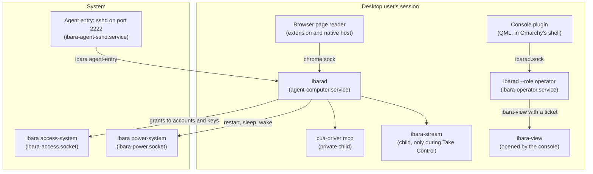
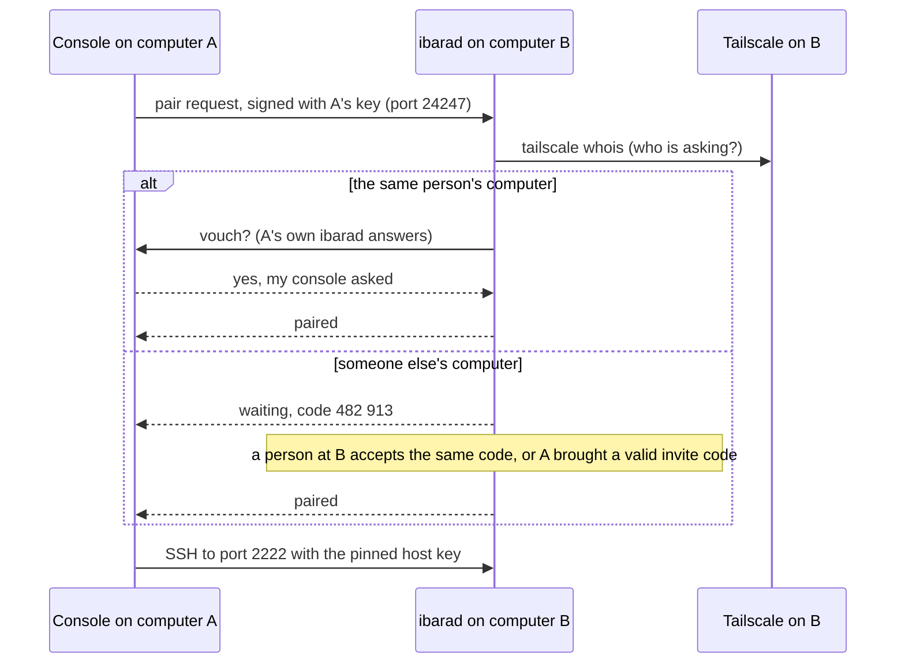
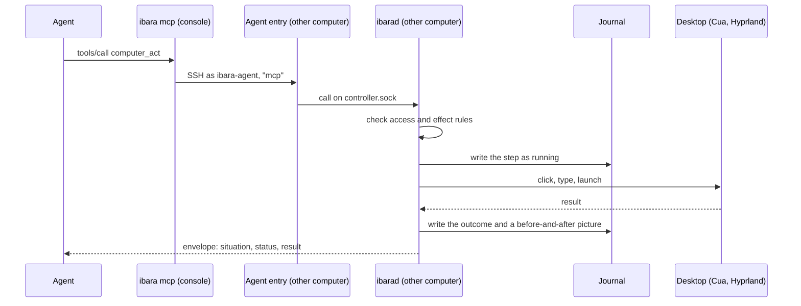
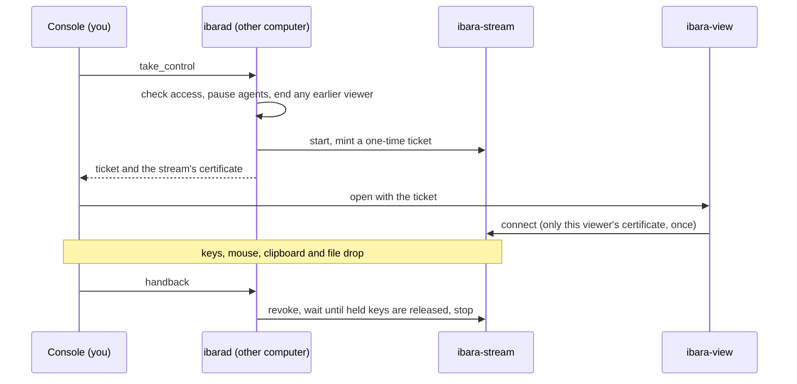

# Architecture

ibara is one Rust crate that builds 2 programs, `ibarad` and `ibara`, plus a console plugin for Omarchy's bar and 2 forked programs for Take Control. Every computer installs the same packages and plays both parts: a computer others can use, and a console for using others.

This page describes the parts and how a request travels between them. [Internals](internals.md) has the module-by-module reference.

## The parts on each computer

| Part | Runs as | What it does |
|---|---|---|
| `ibarad` | the desktop user, as `agent-computer.service` | Owns this computer for agents and other consoles: tasks, steps, approvals, access, files, previews and Take Control. Keeps the journal. |
| `ibarad --role operator` | the desktop user, as `ibara-operator.service` | The console's service. Keeps the directory of computers you added, holds one route to each, writes preview pictures for the plugin and opens the viewer. |
| `ibara` | whoever runs it | Short-lived commands: `ibara mcp` for agents, `ibara setup`, `update`, `rollback` and `uninstall`, `ibara prompt`, and the entry points below. |
| Agent entry | root sshd on port 2222, Tailscale addresses only | Accepts only keys of paired computers. Each key has a forced command, `ibara agent-entry`, as `ibara-agent` (agents and files) or `ibara-op-NAME` (a paired console). |
| `ibara access-system` | root, started per connection by `ibara-access.socket` | Turns the saved grants into Unix accounts, key files and the agent entry's key list. It accepts decisions, never commands or paths. |
| `ibara power-system` | root, started per connection by `ibara-power.socket` | Restart, shut down and sleep, turning on wake-on-network before sleep, and starting an update of ibara (the newest signed release, checked as `ibara update` checks it) or of Omarchy (`omarchy-update -y` as the desktop account, with passwordless `sudo` for that run only), for callers with the Administer permission. |
| Cua driver | the desktop user, a private child of `ibarad` | Reads apps through accessibility, types, clicks and draws each agent's named cursor. Its Hyprland plugin is built on each computer for its exact Hyprland. |
| `ibara-stream` | the desktop user, a child of `ibarad` | The streaming host for Take Control, started only while someone holds control. |
| `ibara-view` | the desktop user, opened by the console | The viewer window for Take Control. |
| Browser page reader | inside Chrome or Chromium, with `ibara chrome-host` as its native host | Reads pages, finds elements and reports where a click landed. It never clicks or types by itself. |
| Console plugin | inside Omarchy's shell | The bar mark, the quick panel and the console. It talks only to the local console service. It lives in the [omarchy-ibara](https://github.com/MayberryDT/omarchy-ibara) repository. |

There is no Node or Python at run time. `ibarad` runs one single-threaded async runtime and streams large bodies instead of holding them, because it has to stay small on a computer that is busy doing other work.

## How computers reach each other

All traffic between computers goes over Tailscale. ibara opens these ports, on the computer's Tailscale addresses only:

| Port | What |
|---|---|
| TCP 2222 | The agent entry (SSH). Agents, file transfers and consoles use it. |
| TCP 24247 | Pairing: one JSON line each way, to add a computer. |
| TCP 47984, 47989 and 48010, UDP 47998, 47999, 48000 and 48002 | Take Control's stream, only while someone holds control. |

If ufw is on, `ibara setup` opens exactly these ports on the `tailscale0` interface and nothing else.

## Adding a computer

The asking computer proves it holds its key by signing the request. Tailscale says which computer and which login is asking, because its WireGuard connection has already authenticated them. When both computers belong to the same Tailscale login, the asking computer's own ibara confirms that its console made the request, and the pairing needs no person. Otherwise a person on the other computer accepts a 6-digit code shown on both screens, or the asking computer brings a single-use invite code.

Once paired, the console pins the other computer's SSH host key and keeps a verified row in its directory. [Security and access](security-and-access.md) explains what each kind of pairing may do.

## An agent's call

`ibara mcp` answers the tool list itself, so an agent loads ibara without touching any computer. The first call to a computer opens one SSH route to it, kept for the session. Each agent is named by its MCP client name, shortened for well-known agents (`codex-mcp-client` is `codex`), and the paired computer it came from, for example `codex@laptop`, and the computer vouches for that name.

`ibarad` writes every effect to the journal as running before it happens. After a restart, anything still running becomes unknown, and the agent is told so instead of being told it worked. A step whose effect class asks first (by default sending, spending, deleting or changing access) stops as pending with an attention item, and runs only when a person approves that exact step.

The desktop has one owner at a time. While an agent holds control, Hyprland's pointer is hidden and the agent's named cursor shows where it works. When a person moves the mouse, the pointer comes back at once and the agent's next input waits or is refused.

## Take Control

Each console has one viewer identity, made on the first Take Control. The other computer admits only that viewer, only with a fresh ticket. Closing the viewer keeps control and the pause, and Open Viewer starts it again. Hand Back ends the stream and lets agents work again, unless a person paused them or ibara is still settling earlier work; it never restarts an agent's task by itself.

## What is stored where

| File | On | Holds |
|---|---|---|
| `~/.local/state/agent-computer/journal.sqlite` | every computer | Tasks, operations, approvals, the access model, the timeline and app notes |
| `~/.local/state/agent-computer/storage.sqlite` | every computer | Files, artifacts, jobs and procedures. Task workspaces are in `~/.local/share/agent-computer/` |
| `~/.local/state/ibara/operator.sqlite` | every console | The directory of computers you added and their pinned routes |
| `~/.config/ibara/settings.toml` | every computer | Settings you can change in the console or by hand |
| `/etc/agent-computer/` | every computer | Root-owned keys, policy and the agent entry's configuration |
| `~/Downloads/Ibara` | every computer | Files other computers sent to you |

The journal is SQLite and changes only by additive migrations. Before an update, `ibara update` copies the journals, and `ibara rollback` puts that copy back when the newer release had moved the journal forward.

## Releases and updates

A release is 3 packages at one version (`ibara`, `ibara-stream` and `ibara-view`), a signed manifest (`stable.json` and `stable.json.sig`), the installer and the full source. `packaging/release.sh` builds them, and `packaging/publish.sh` uploads them as a GitHub release. `ibara update` checks the manifest's signature against the key built into ibara and each package's digest before one `pacman -U` of all 3. [Release verification](release-verification.md) shows how to check the same things by hand.
